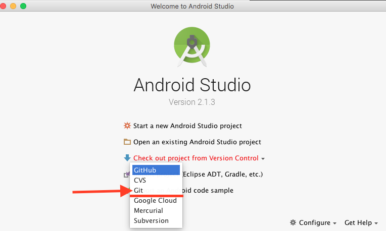
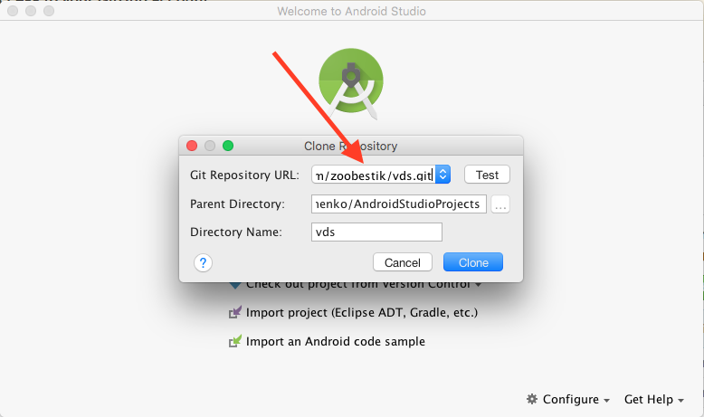
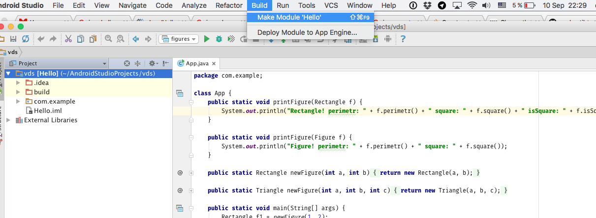
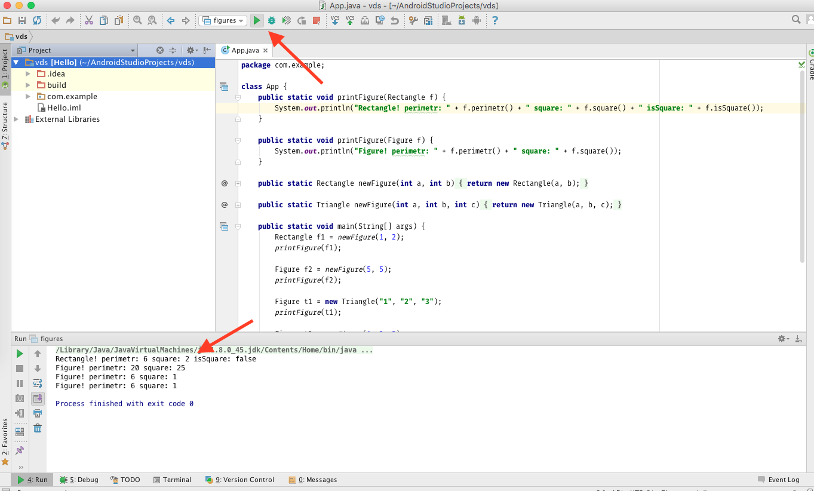

# Java Project example

Как открыть из [Android Studio](https://developer.android.com/studio/index.html):

1. `Checkout project from Version Control` -> **`git`**

2. `Clone Repository` -> `Git Repository URL` -> https://github.com/zoobestik/vds.git

3. `Build` -> `Make Module 'Hello'`

4. `Run`

Пункты 3 и 4 делать каждый раз, когда поменял исходник.